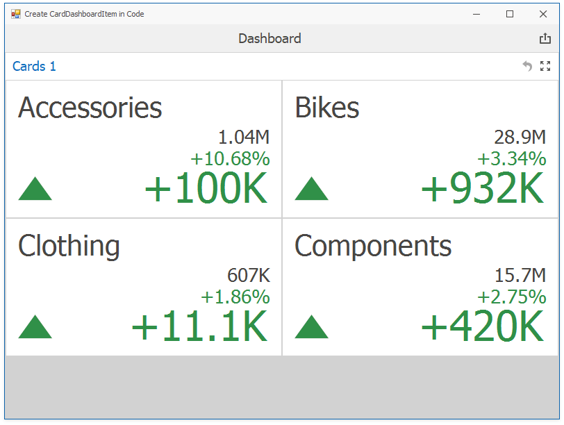

<!-- default badges list -->

<!-- default badges end -->
*Files to look at*:

* [ViewerForm1.cs](./CS/DXApplication1/ViewerForm1.cs) (VB: [ViewerForm1.vb](./VB/DXApplication1/ViewerForm1.vb))

# How to Bind a Card Dashboard Item to Data in Code

This example shows how to bind a [Card dashboard item](http://docs.devexpress.com/Dashboard/15263/) to data in code.

API in this example:

* [CardDashboardItem](https://docs.devexpress.com/Dashboard/DevExpress.DashboardCommon.CardDashboardItem) class
* [Card](https://docs.devexpress.com/Dashboard/DevExpress.DashboardCommon.Card) class
* [Card.ActualValue](https://docs.devexpress.com/Dashboard/DevExpress.DashboardCommon.KpiElement.ActualValue) property
* [Card.TargetValue](https://docs.devexpress.com/Dashboard/DevExpress.DashboardCommon.KpiElement.TargetValue) property
* [Card.SeriesDimensions](https://docs.devexpress.com/Dashboard/DevExpress.DashboardCommon.SeriesDashboardItem.SeriesDimensions) property
* [CardDashboardItem.Cards](https://docs.devexpress.com/Dashboard/DevExpress.DashboardCommon.CardDashboardItem.Cards) property

## Documentation

- [Binding to Data](https://docs.devexpress.com/Dashboard/116771) 
- [Dashboard Items](https://docs.devexpress.com/Dashboard/116521)
- [Card Dashboard Item](http://docs.devexpress.com/Dashboard/15263/)

## More Examples 

* [How to bind a Pie dashboard item to data in code](https://github.com/DevExpress-Examples/how-to-bind-a-pie-dashboard-item-to-data-in-code-e4769)
* [How to add window calculations for numeric measures in code](https://github.com/DevExpress-Examples/winforms-dashboard-window-calculation-example) 
* [How to bind a Treemap dashboard item to data in code](https://github.com/DevExpress-Examples/how-to-bind-a-treemap-dashboard-item-to-data-in-code-t429531)
* [How to bind a Bound Image dashboard item to data in code](https://github.com/DevExpress-Examples/how-to-bind-a-bound-image-dashboard-item-to-data-in-code-t382366)
* [How to bind a Scatter Chart dashboard item to data in code](https://github.com/DevExpress-Examples/how-to-bind-a-scatter-chart-dashboard-item-to-data-in-code-t306222)
* [How to bind a Pivot dashboard item to data in code](https://github.com/DevExpress-Examples/how-to-bind-a-pivot-dashboard-item-to-data-in-code-e4772)
* [How to bind a Gauge dashboard item to data in code](https://github.com/DevExpress-Examples/how-to-bind-a-gauge-dashboard-item-to-data-in-code-e4771)
* [How to bind a Grid dashboard item to data in code](https://github.com/DevExpress-Examples/how-to-create-a-new-dashboard-add-a-grid-dashboard-item-to-it-and-bind-it-to-data-in-code-e4768)
* [How to bind a Choropleth Map dashboard item to data in code](https://github.com/DevExpress-Examples/how-to-bind-a-choropleth-map-dashboard-item-to-data-in-code-e5010)
* [How to bind a Geo Point Map dashboard item to data in code](https://github.com/DevExpress-Examples/how-to-bind-a-geo-point-map-dashboard-item-to-data-in-code-e5036)
* [How to bind a Pie Map dashboard item to data in code](https://github.com/DevExpress-Examples/how-to-bind-a-pie-map-dashboard-item-to-data-in-code-t119627)
* [How to bind a Chart dashboard item to data in code](https://github.com/DevExpress-Examples/how-to-bind-a-chart-dashboard-item-to-data-in-code-e4767)
